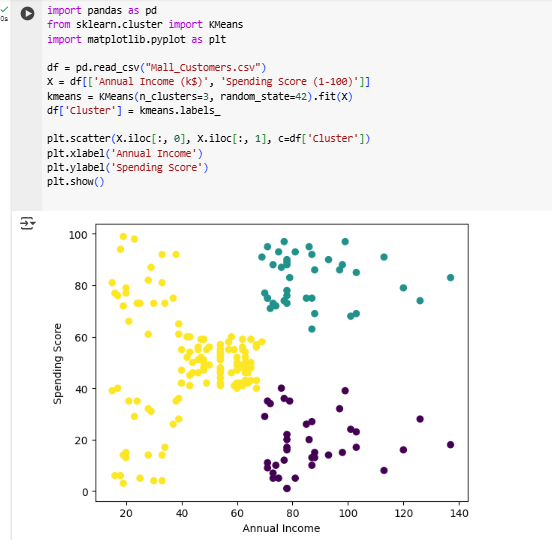

# Customer Segmentation using K-Means
This project applies K-Means clustering on retail customer data to segment them based on spending habits.

## Dataset
[Kaggle - Mall Customers]((https://www.kaggle.com/datasets/shwetabh123/mall-customers))

## Tech Stack
- Python (Pandas, Matplotlib, Seaborn, Scikit-learn)
- Jupyter Notebook

## Usage
Run `customer_segmentation.ipynb` in Jupyter Notebook.

## Output

